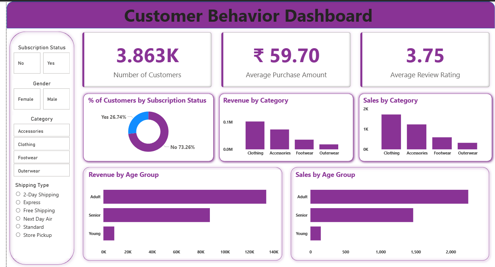

# 📊 Customer Behavior Analysis | SQL & Power BI

## 📌 Project Overview
This is a **data analysis project** built using **SQL and Power BI** to analyze customer purchasing behavior. The project focuses on understanding sales trends, customer segmentation, and subscription patterns through an interactive dashboard.

The analysis aims to derive simple, actionable business insights that support data-driven decision making.

---

## 🎯 Objective
- Analyze customer purchasing behavior  
- Understand subscription vs non-subscription patterns  
- Identify high-performing product categories  
- Study age-group-wise sales and revenue trends  

---

## 🛠️ Tools & Technologies
- **Microsoft Excel** – Manual data cleaning and preparation  
- **SQL** – Data analysis and aggregation  
- **Power BI** – Data modeling and interactive dashboard creation  

---

## 📂 Dataset Summary
The dataset contains customer-level transaction data including:
- Customer demographics (age, gender)
- Product categories
- Subscription status
- Purchase amount
- Review ratings
- Shipping type
- Discount information

---

## 🧹 Data Cleaning (Excel)
Data cleaning was performed manually in Excel before loading the dataset into SQL.

Steps followed:
- Replaced **null review ratings** with the **average rating of the respective product category**
- Removed **duplicate rows**
- Standardized text values (consistent casing)
- Added helper columns for efficient data handling
- Replaced spaces with **underscores** in column names for SQL compatibility
- Created a new **age group** column
- Removed unnecessary columns (e.g., promo code applied, since discount information was already available)
- Saved the cleaned dataset and uploaded it into SQL

---

## 🧮 Data Analysis Using SQL
SQL was used to query and aggregate the cleaned dataset.

Concepts and functions used:
- `GROUP BY`
- `COUNT()`
- `SUM()`
- `AVG()`
- `CASE WHEN`
- **Window functions (`ROW_NUMBER()`)** for ranking and segmentation

The SQL output was then connected to Power BI for visualization.

---

## 📊 Dashboard & Results
The Power BI dashboard includes:
- KPI cards for:
  - Total customers
  - Average purchase amount
  - Average review rating
- Subscription vs non-subscription customer distribution
- Category-wise sales and revenue
- Age-group-wise sales and revenue
- Interactive slicers for:
  - Gender
  - Product category
  - Shipping type
  - Subscription status

📸 *Dashboard preview*

## 📈 Key Business Insights
- Majority of customers are **non-subscribers**
- **Clothing** is the highest-performing category in terms of sales and revenue
- **Adult customers** contribute the most to overall purchases
- Younger age groups show lower purchasing activity
- Average review ratings indicate moderate customer satisfaction

---

## 💡 Business Recommendations
- **Boost subscriptions** through exclusive offers or subscription-based discounts
- Introduce **customer loyalty programs** to improve retention
- Use **targeted marketing** for high-performing categories
- Design age-group-specific promotions
- Improve customer experience based on review insights

---

## ✅ Conclusion
This project demonstrates the use of **Excel, SQL (including window functions), and Power BI** for customer behavior analysis. It showcases foundational data analysis skills such as data cleaning, querying, ranking, visualization, and insight generation, making it suitable for entry-level data analyst roles.
